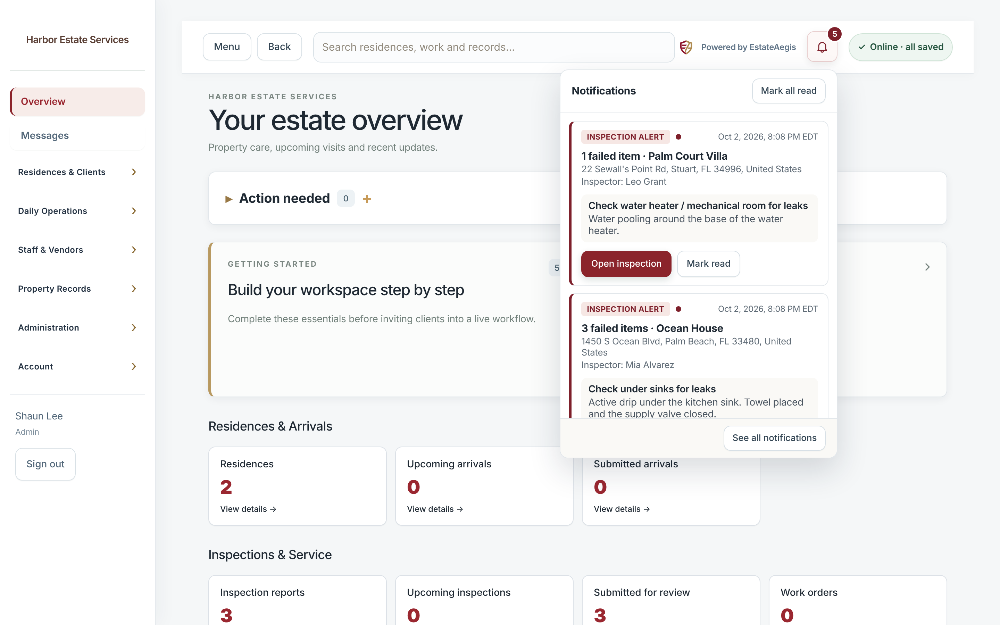
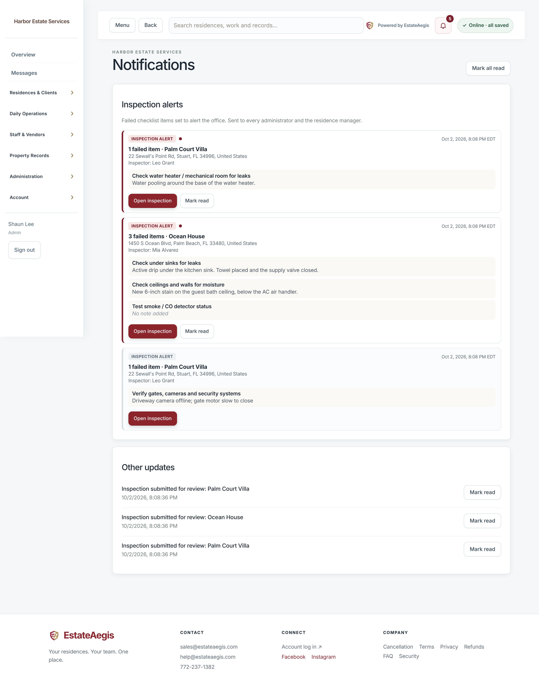
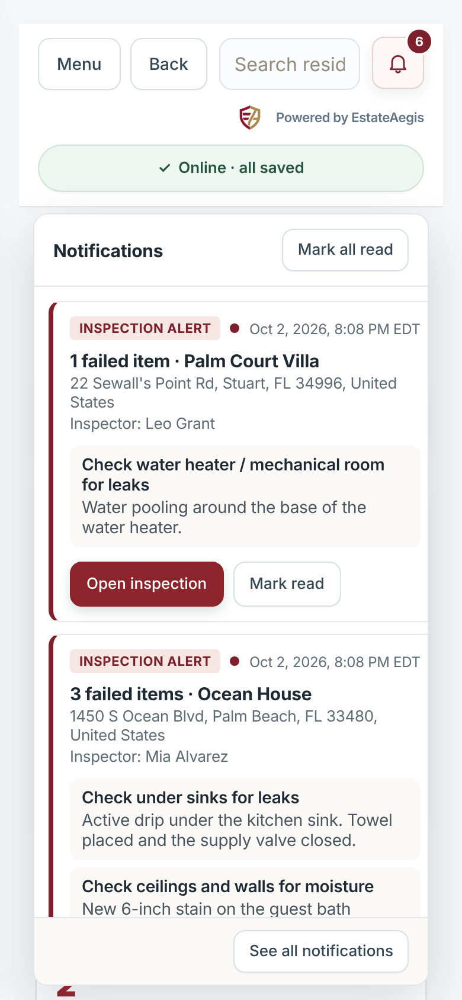
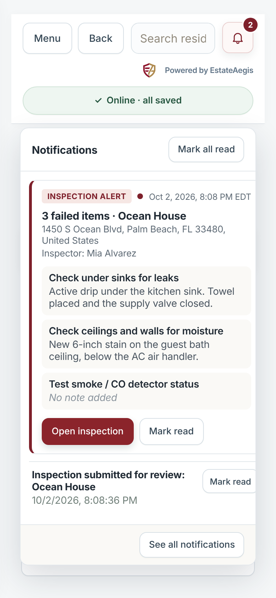
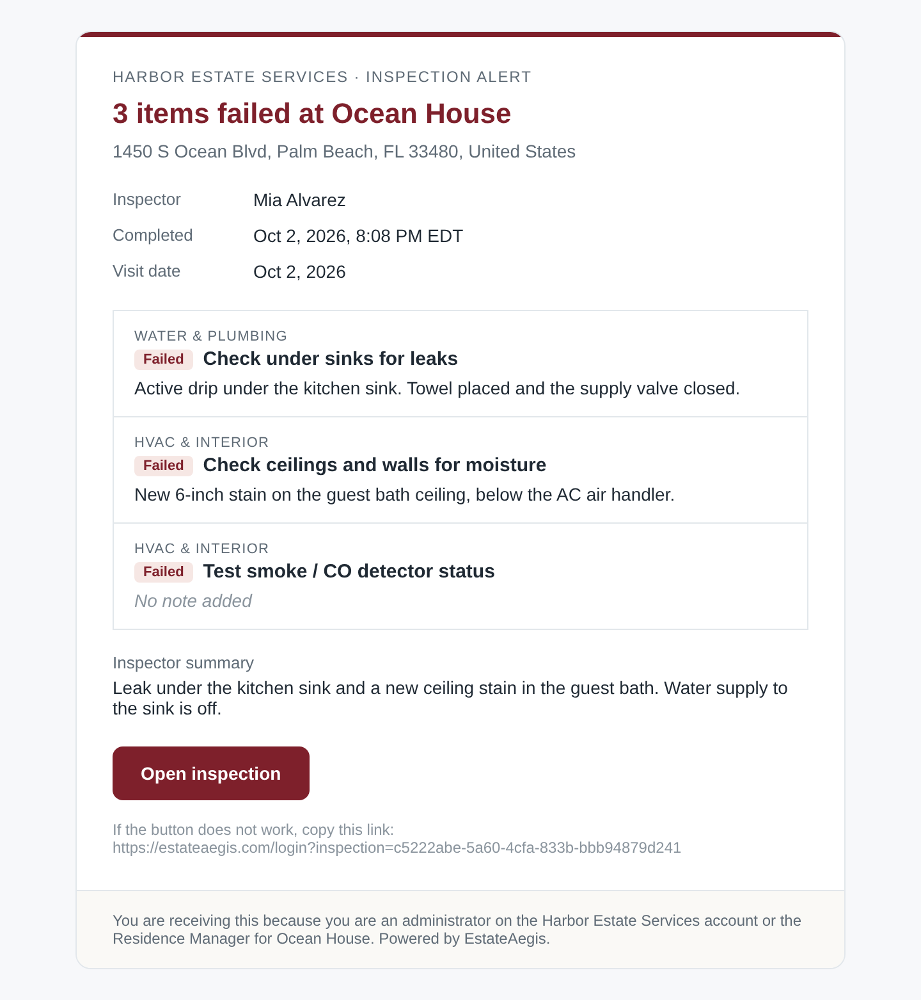

# Checklist fail alerts ("Alert the office on fail")

When a field visit is completed with failed checklist items that are set to **Alert the office on fail**, the office gets **one alert for that inspection**, in the app and by email.

## When it fires

- On `POST /api/inspections/submit` (draft → submitted), including offline-synced submissions.
- On `POST /api/inspections/publish` when an admin publishes straight from a draft.
- At most once per inspection. The `inspection_fail_alerts` primary key is written in the same transaction as the status change, so these cases never send a second alert: Idempotency-Key replays, a retry with a new key (the visit is already submitted), reopen then resubmit, and submit then publish.
- A visit counts as failed when an item is **Attention** (the built-in checklist's fail result, shown as "Action needed" on reports) or **Fail** (pass/fail/N/A template items). **Monitor** is not a failure.

## Which failed items alert

Field visits started from a published template are linked to it (see [visits-use-templates.md](visits-use-templates.md)). To decide whether an item alerts:

1. **Linked visit** (`template_version_id`, or `template_id` + `template_version`, is set): the item in that exact template version, matched **only by `stable_key`**. If that version row is missing, the visit's own `checklist_snapshot` is used. There is no wording fallback, so renaming an item never changes which item alerts.
2. **Unlinked visit** (built-in checklist, and every visit created before templates were linked): the latest **published** version of each active company template with the same visit type. A failed item alerts when a template item with the same key or the same wording (ignoring case, spacing and punctuation) has alert-on-fail switched on. Drafts and archived templates are ignored.

## Recipients

- Every **active admin** on the company account.
- The **Residence Manager** for that residence (`properties.account_manager_id`, set with "Select Residence Manager"), when that person is an active admin or staff account.
- Each person gets one copy. Family (client) and vendor accounts never get one, and neither does other staff.

## Delivery

- **In-app:** a row in `notifications` with `kind='inspection_fail'`. Staff see a bell in the top bar with the unread count, plus a panel listing unread alerts: residence, address, inspector, time, and every failed item with its note. **Open inspection** opens the visit and marks the alert read. The Notifications page has an "Inspection alerts" section and **Mark all read**. `GET /api/notifications`, `POST /api/notifications/read` and `POST /api/notifications/read-all` only ever touch the signed-in user's own rows.
- **Email:** queued in the existing `email_outbox` and sent by the existing Resend worker (`communications.drain`). It sends HTML plus plain text and retries with backoff. It is skipped for private demos and cancelled for suspended workspaces or deactivated users. Environment variables: `RESEND_API_KEY` (required to send), plus the optional `EMAIL_FROM` and `APP_URL`, which must be https and is used for the "Open inspection" link (`/login?inspection=<id>`). Without `RESEND_API_KEY` the alert is still created in the app, the email stays queued, and the server logs one line.
- Times use the residence's timezone, or Eastern (`America/New_York`) when none is set. There is no company-level timezone.

## Migration

`migrations/033_checklist_fail_alerts.sql` is additive only and runs on SQLite and Postgres:
- adds `notifications.kind` and `notifications.body`
- adds `email_outbox.html`
- creates `inspection_fail_alerts`

## Screenshots

