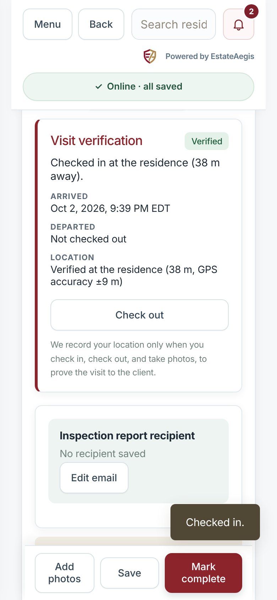
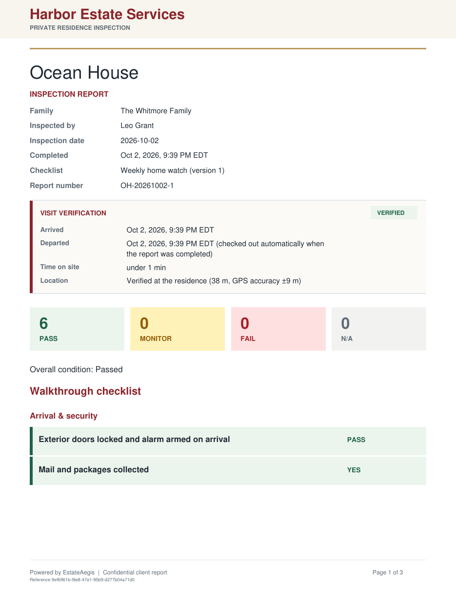
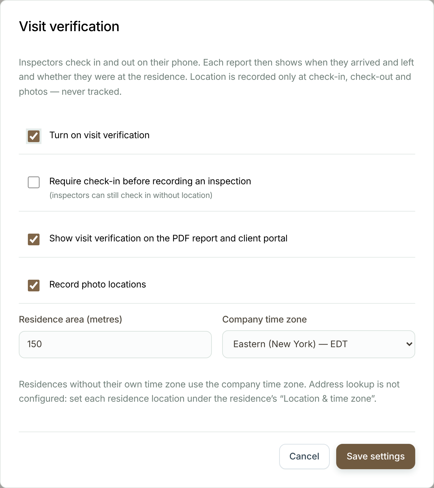
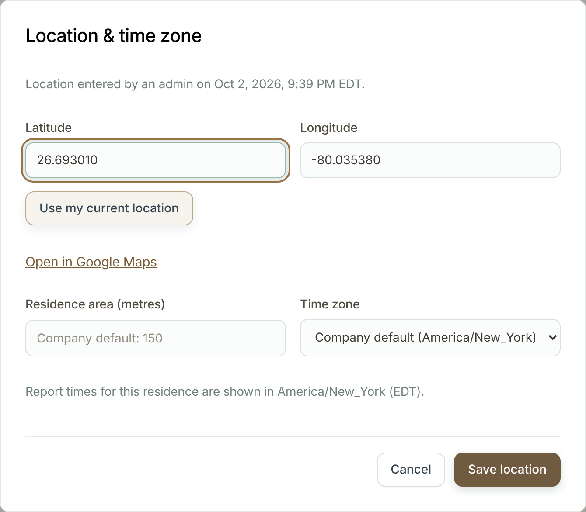
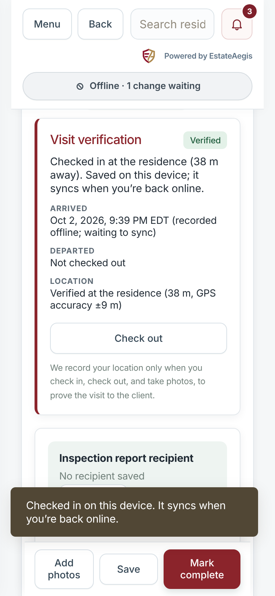
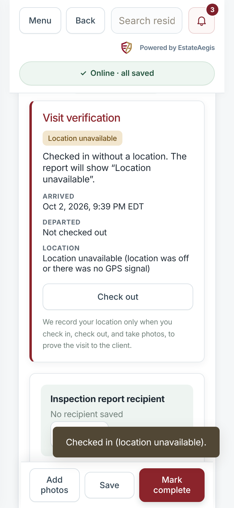
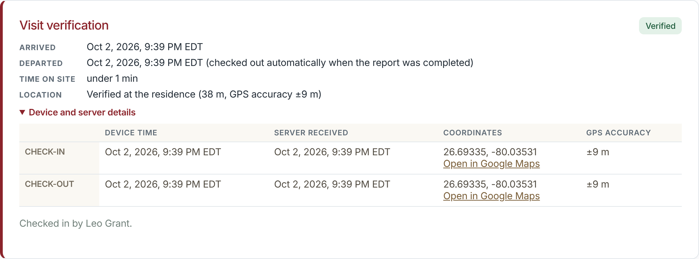
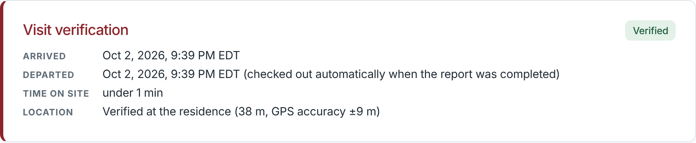

# Visit verification (GPS and timestamp proof of visit)

Each inspection report can show a **Visit verification** box: when the inspector arrived, when they left, how long they were there,
and whether their phone was at the residence. The box appears on the PDF report, in the client portal, and on the visit in the app.

Report times now always use the **residence's time zone**. If the residence has no time zone set, the company's is used, then Eastern.
Before this change every report time was shown in Eastern.

## Turn it on (admins)
1. Go to **Company** and tap **Visit verification**.
2. Tick **Turn on visit verification**. It is off until you do this, and nothing changes for your team or clients until then.
3. Optional settings:
   - **Require check-in before recording an inspection.** Inspectors can't save checklist answers until they check in. Checking in
     without location still counts, so nobody gets stuck.
   - **Show visit verification on the PDF report and client portal.** On by default.
   - **Record photo locations.** On by default.
   - **Residence area (metres).** How close the phone must be to count as "at the residence". The default is 150 m.
   - **Company time zone.** Used for any residence that doesn't have its own time zone.

## Residence location
To check distance, EstateAegis needs each residence's map position (latitude/longitude).
- **If address lookup is configured** (the server has a `GEOAPIFY_API_KEY`), addresses are looked up automatically. This covers new
  addresses, edited addresses, and existing residences, which are filled in by a slow background job.
- **If it isn't configured**, an admin sets the position on the residence page under **Location & time zone**. You can either:
  - type the latitude and longitude (copy them from Google Maps: right-click the house → the numbers at the top), or
  - tap **Use my current location** while standing at the residence.
- The same dialog sets a different **residence area** or **time zone** for that residence.
- Until a residence has a position, its visits show **Residence location not set**. The arrival and departure times are still recorded
  and shown.

## For inspectors (phone)
1. Open the visit and tap **Check in** when you arrive. The first time, the app explains why it asks for your location. Then your phone
   asks for permission.
2. Do the inspection as usual. Photos you take in the app record where they were taken, if photo locations are on.
3. Tap **Check out** when you leave. If you forget, **Mark complete** checks you out automatically, and the report says so.

- **No signal?** Check-in and check-out still work. They're saved on the phone with the phone's time and location, and sent when you're
  back online. The report shows both the phone's time and the time the server received it. If the phone's clock looks wrong, the report
  says so.
- **Location turned off or denied?** You can still check in and finish the visit. It is shown as **Location unavailable**. To turn
  location back on:
  - iPhone: **Settings → Privacy & Security → Location Services → Safari Websites** (or the EstateAegis app) → **While Using**.
  - Android: tap the lock icon next to the address in Chrome → **Permissions → Location**.
- Your location is recorded **only** when you check in, check out, or take a photo. The app never tracks you in the background.

## What the statuses mean
| Status | Meaning |
| --- | --- |
| **Verified** | The phone was within the residence area at check-in. |
| **Outside residence area** | The phone was farther away than the residence area allows. The distance is shown. |
| **Location unavailable** | Location was denied, turned off, or timed out. The times are still recorded. |
| **Residence location not set** | The residence has no map position yet (see above). |
| **Verified by administrator** | An admin confirmed the visit and gave a reason. The original reading stays in the details. |

## For admins
- The inspections list shows a status badge on each visit. Use the filter bar (**All visits**, **Verified**, **Outside area**, **No location**,
  **Not checked in**) to find visits that need a look.
- **Details** on a visit shows exact coordinates, GPS accuracy, phone and server times, and a Google Maps link. Only admins (and the
  inspector, for their own visits) see the coordinates.
- **Mark verified** (in the visit's details) marks a visit as verified, for example when GPS was poor inside a large house. It needs a reason of at least
  10 characters, and the action is recorded in the audit history.
- Published reports now get a short **report number**, e.g. `OH-20261002-1`. The long reference moves to the PDF footer.

## What clients see
Clients see the status, arrival and departure times, time on site, and the distance from the residence. They never see coordinates.
Older reports, and companies that don't use the feature, show no box. Report times use the residence's time zone in both cases.

## Privacy
- Location is recorded only at check-in, check-out and photo capture, and only for staff using the app.
- Location data (GPS) embedded in uploaded photos is always removed before storage. The position recorded at capture is stored separately and only admins see it.
- With address lookup configured, residence addresses are sent to Geoapify to find their map position.
