# Hurricane and storm workflow

When a storm is coming, an admin creates a **storm**, adds every residence in its path in one step, and schedules a pre-storm visit at each of them at once. The **storm status board** then shows, live, which homes are secured, which still need work, and, after the storm, which were checked and where damage was found. Each residence gets an **insurance-claim-ready storm report** (PDF) that families can download from their portal.

Storm visits are ordinary inspections that use the published **Hurricane prep** and **Post-storm** checklists. They open, work offline, sync, take photos, record Pass / Monitor / Fail / N/A, raise fail alerts and carry GPS visit proof exactly like any other visit.

Open it from **Daily Operations → Storms** (admins and staff).

## Who can do what

| | Admin | Staff (employee) | Client | Vendor |
|---|---|---|---|---|
| Create, edit, close storms; add or remove residences; assign; schedule visits; message families; CSV and summary PDF | ✅ | – | – | – |
| See the board | All residences | Only residences assigned to them (or where they are the Residence Manager) | – | – |
| Update prep / post status and internal notes | ✅ | Their own rows only | – | – |
| Open the residence of a storm assignment | ✅ | ✅ while the storm is not closed | – | – |
| Storm status and storm report in the portal | – | – | Their own residences, once a storm visit is published | – |

## 1. Create a storm (three steps)

**Storms → New storm** opens a full-page, three-step form.

1. **Storm details:** name, type (Hurricane, Tropical storm, Freeze, Flood, Wildfire, Other), expected impact, preparation deadline, post-storm check target and notes for the team. Times are entered in the device's local time.
2. **Residences:** filter by city, ZIP code, Residence Manager or a search, then **Select all matching**, tick individual homes, or both. The selection is kept while you change filters, so you can pick all of Jupiter, then add one home in Stuart. Residences already on the storm are shown and can't be added twice.
3. **Pre-storm visits:** visit date, checklist (newest published Hurricane prep checklist by default, or a specific version), and who gets each visit:
   - **Each Residence Manager** (anyone without a manager goes to you),
   - **Share among team members** (round robin in residence-name order, the default when some homes have no manager), or
   - **One team member**.
   A live list shows who gets each visit before you confirm. **Skip for now** schedules nothing.

| Details | Residences | Visits | Phone |
|---|---|---|---|
| 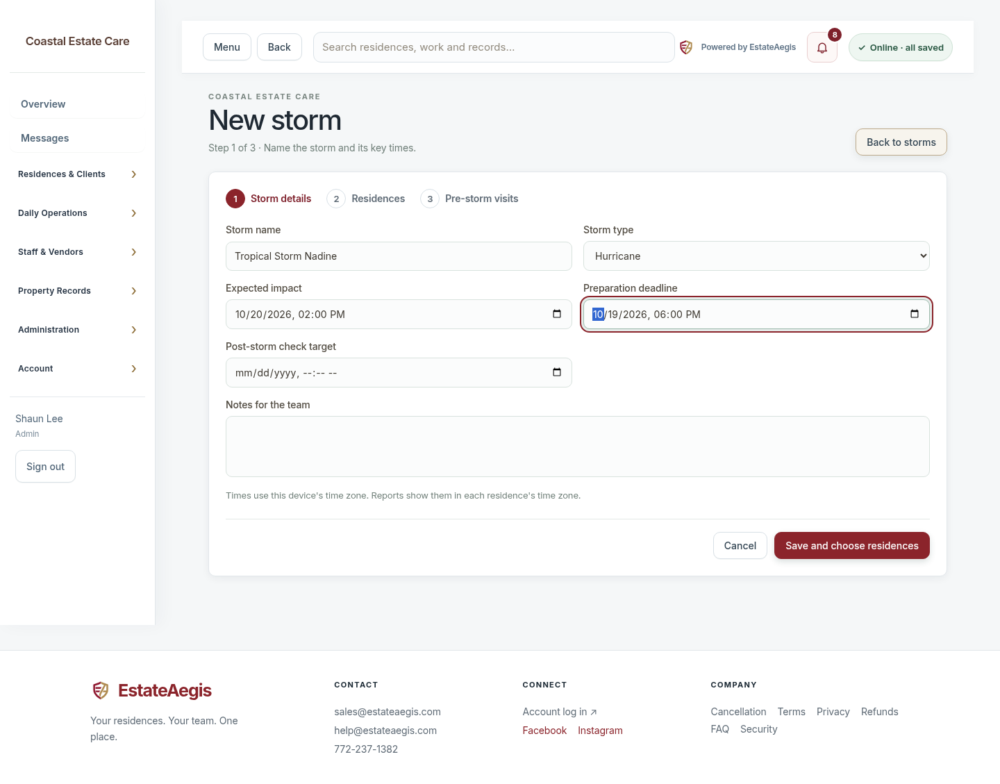 | 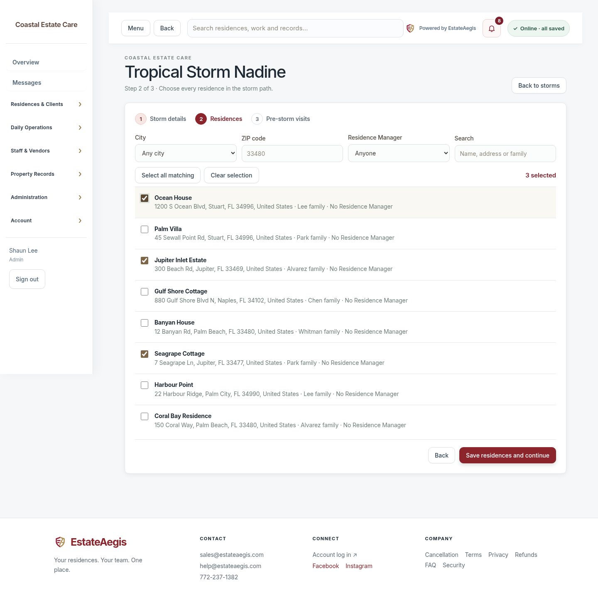 | 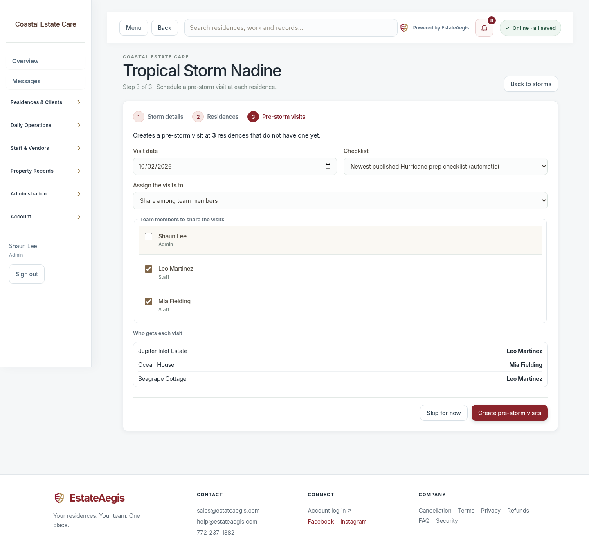 | 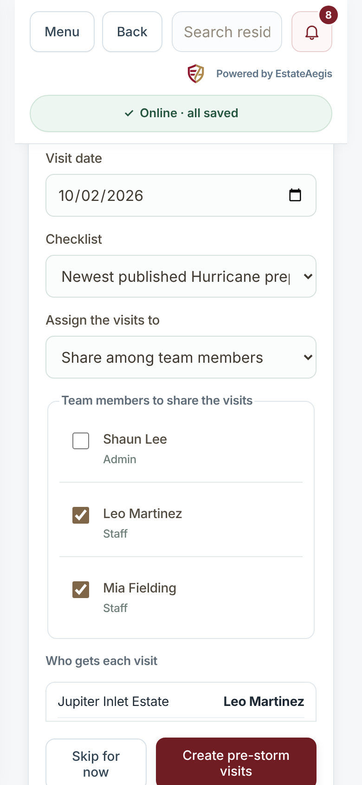 |

Scheduling never creates a second pre-storm (or post-storm) visit for the same residence; repeats are skipped and the reason is shown. If the company has no published Hurricane prep (or Post-storm) checklist yet, the starter checklist is published automatically and used. Each assignee gets one in-app notice listing how many storm visits they were given.

## 2. The storm status board

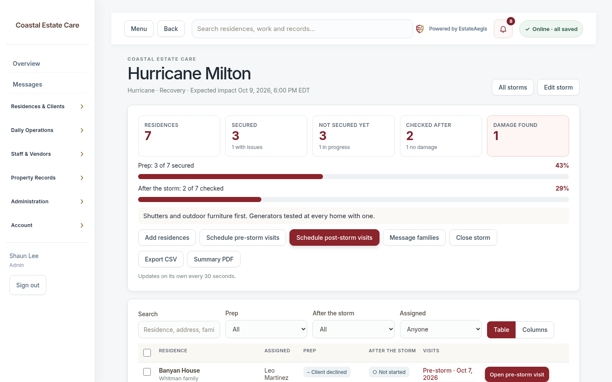

- **Tiles:** residences, secured (and how many with issues), not secured yet, checked after the storm, damage found. Progress bars for preparation and post-storm checks.
- **Table / Columns:** a table, or columns grouped by prep status (by after-the-storm status during Recovery). On a phone each residence is a card with large buttons.
- **Filters:** search, prep status, after-the-storm status, assignee.
- **Bulk actions:** tick residences to update their status, assign them, schedule pre- or post-storm visits, message their families, or remove them from the storm.
- **Update status:** large choices for prep status, after-the-storm status and damage severity, plus internal notes (staff only, never shown to clients).
- **Repair work orders from this storm:** follow-up work created from a storm visit's findings is linked to the storm.
- **Export CSV** and **Summary PDF** (admins).
- The board refreshes itself every 30 seconds while it's open.

| Status dialog | Phone | Phone cards |
|---|---|---|
| 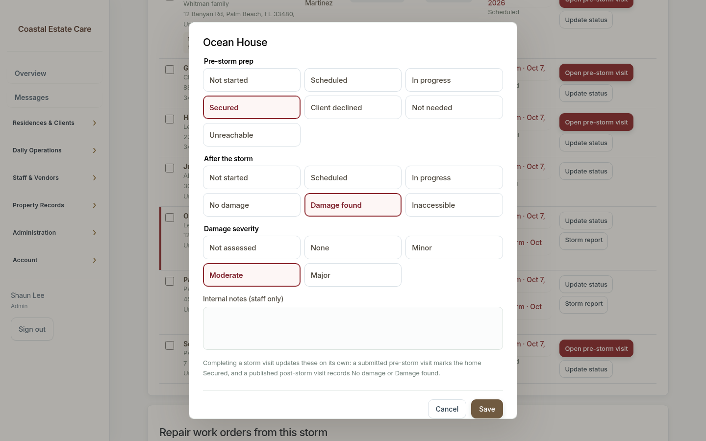 | 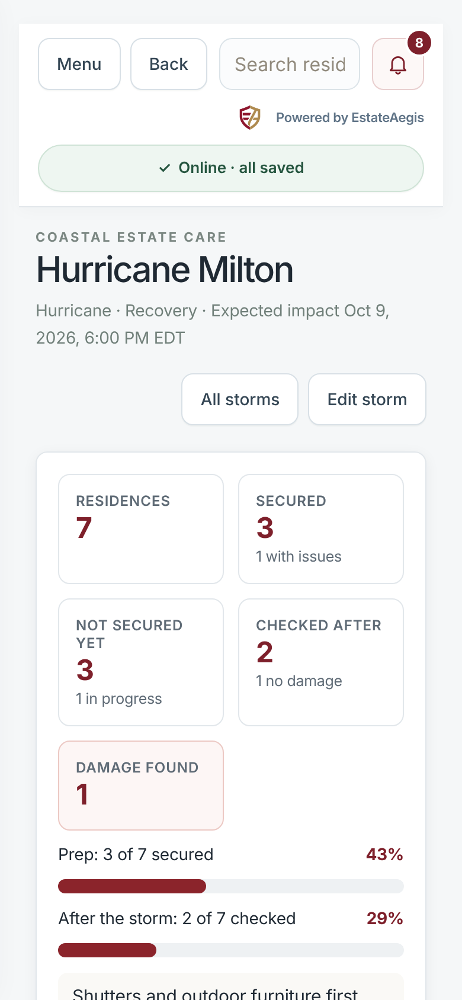 | 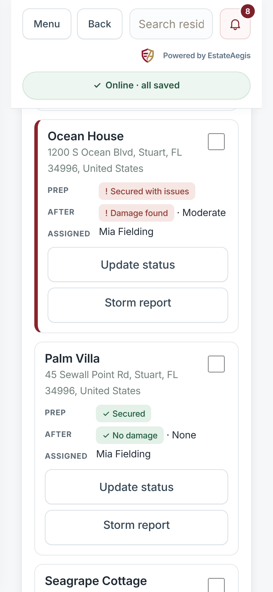 |

### Statuses update on their own

| Event | Board |
|---|---|
| Visit scheduled | Prep (or After the storm): **Scheduled** |
| First results saved on the visit | **In progress** |
| Pre-storm visit submitted | **Secured** (with the number of failed items, shown as "Secured with issues") |
| Post-storm visit published | **No damage**, or **Damage found** with a suggested severity |
| Visit reopened or its draft deleted | Back to In progress / Not started |

Severity is suggested from the post-storm checklist: Monitor items only = Minor, 1–2 Fail = Moderate, 3 or more Fail = Major. A severity set by hand is kept; a completed visit always sets the prep or after-the-storm status. **Client declined**, **Not needed**, **Unreachable** and **Inaccessible** are set by hand.

### Storm phases

**Preparing → Storm active → Recovery → Closed.** **Storm passed: start recovery** moves the storm to Recovery and offers to schedule post-storm visits for every secured home that doesn't have one yet. **Close storm** makes the board read-only and ends the temporary residence access that storm assignments gave staff; it can be reopened.

## 3. Doing a storm visit (staff)

Staff see **Storms** with the storm visits assigned to them, a storm banner on their Overview and on the residence, and a **Storm visit** banner on the visit itself with the deadline and what the photos are for. **Make my storm visits available offline** downloads all of their storm visits in one tap; **Plan route for my storm visits** opens the route planner with those residences selected.

| Visit (desktop) | Visit (phone) | My storms (phone) |
|---|---|---|
| 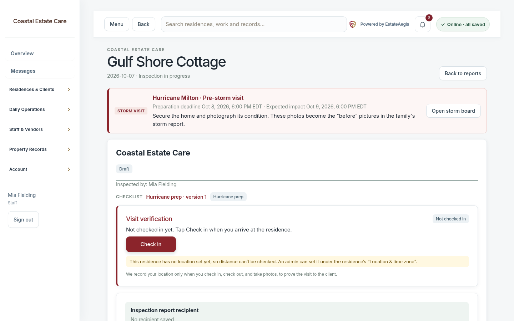 | 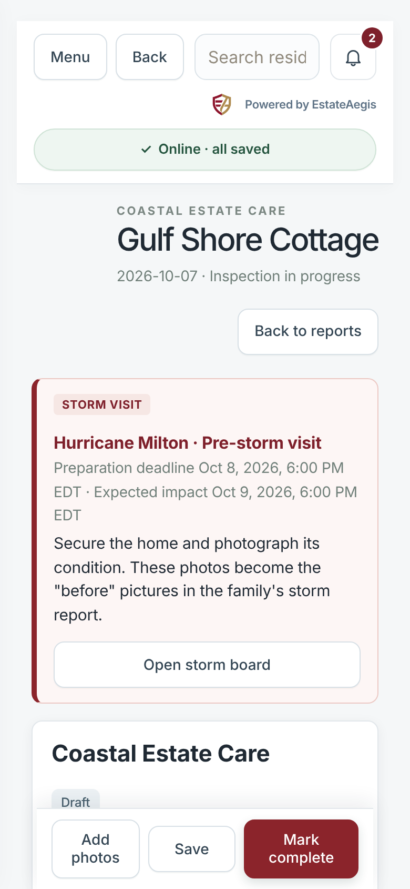 | 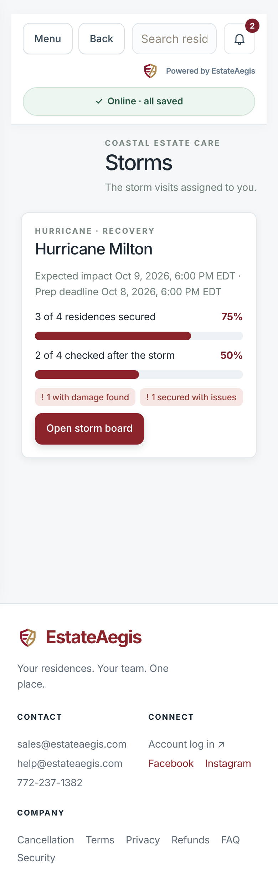 |

Offline: a storm visit completed with no signal is saved on the phone and synced later (the same outbox and Idempotency-Key replays as every other visit); the board updates as soon as it syncs.

## 4. Messages to families

**Message families** (on the board or for selected residences) sends one of three notices: **Storm preparation planned**, **Home secured**, **Post-storm check complete**. A preview shows who gets it and the exact wording before anything is sent. Each notice goes once per residence per storm (repeats are skipped as "Already sent"), to the family's portal users by email and in the app, or to the family email on file when nobody has a portal account. Residences that aren't ready (for example "Not secured yet") are skipped with the reason.

## 5. The client portal

Clients see a storm card for each of their residences on a storm: plain-language prep and post-storm status with the time in the residence's time zone, and **Download storm report (PDF)** once a storm visit is published. Internal notes never appear.

| Desktop | Phone |
|---|---|
| 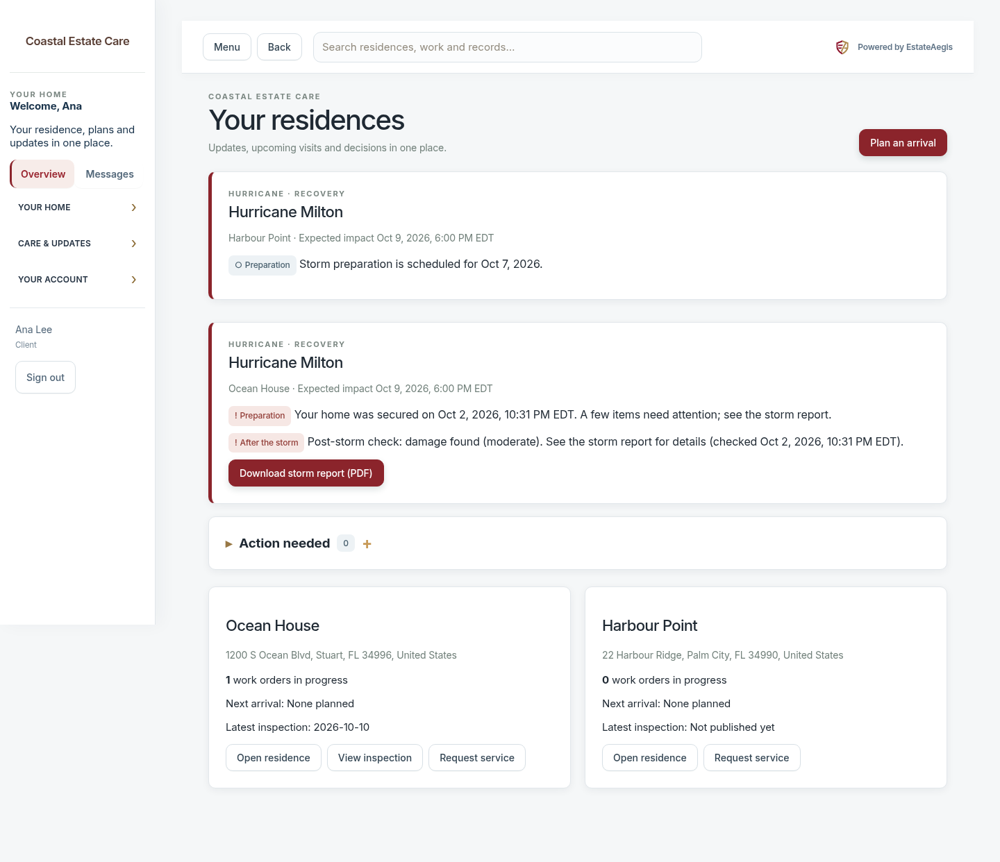 | 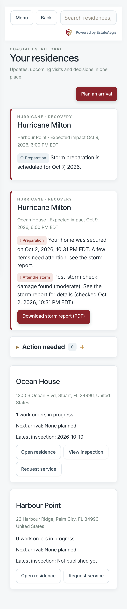 |

## 6. The insurance-claim-ready storm report

One PDF per residence per storm: `Storm-Report-<storm>-<residence>.pdf`.

- Residence, address, family, storm, prepared time; three status cards (pre-storm prep, post-storm check, damage severity).
- **Timeline** in the residence's time zone: visits completed (and by whom), preparation deadline, expected impact.
- **Pre-storm condition:** visit date, completion time, inspector, checklist and version, report number, the GPS **visit verification** box when visit proof is on, the inspector summary, every checklist item with its result and notes, and the photos with the time each was taken.
- **Post-storm findings:** the same for the post-storm visit, with damage and items to watch listed first and the visit's written damage notes.
- **Before and after:** photos paired by checklist item, then by the same photo name, then in the order taken.
- **Repair work orders** from the storm, and the **notes to the client** from both visits.
- Every page has the footer "This report documents observations made during scheduled visits; it is not an insurance adjuster's assessment or a guarantee of condition." and Page X of Y.

Only published storm visits are included in what clients see; staff can download the report at any time to check it before publishing.

| Page 1 | Before and after | Storm summary (admin) |
|---|---|---|
| 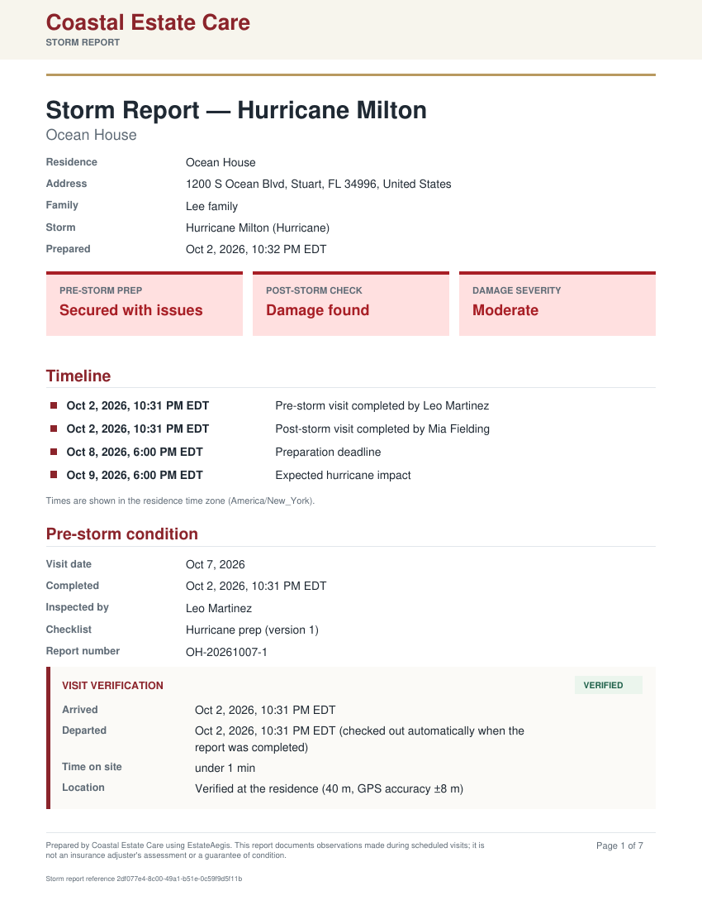 | 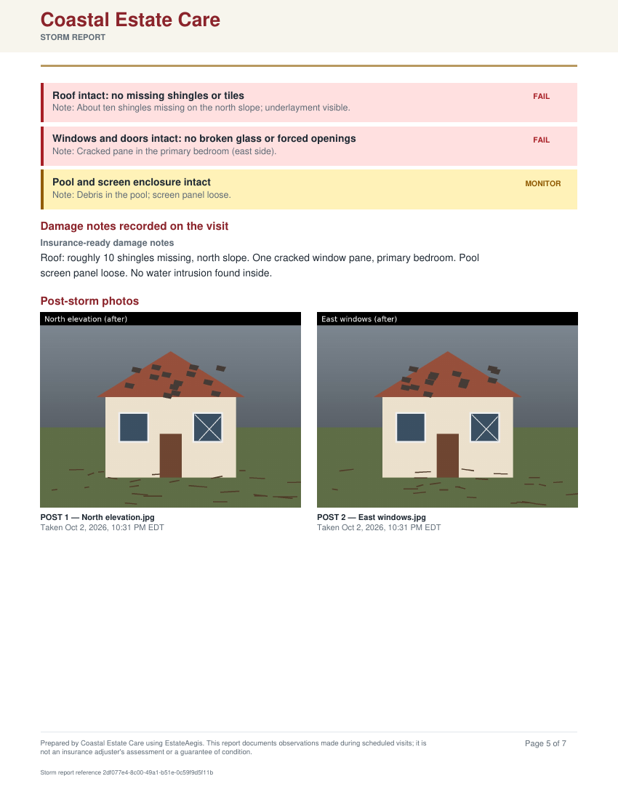 | 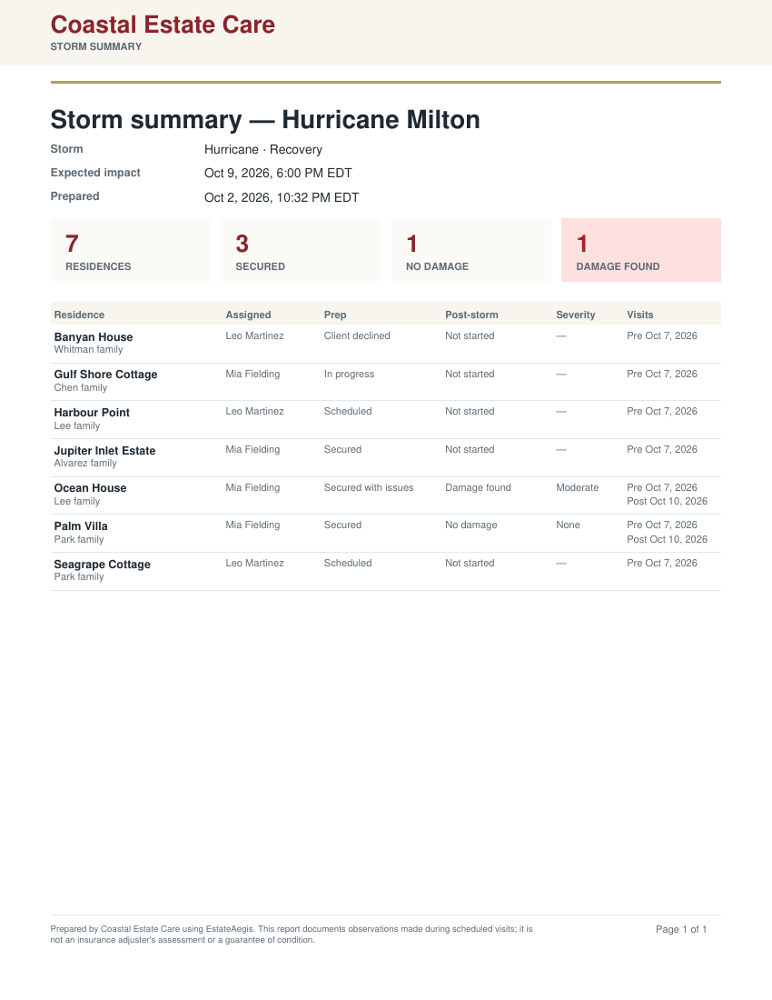 |

## API

| Method | Path | Who |
|---|---|---|
| GET | `/api/storm` | Admin: all storms; staff: their storm residences; client: `{portal}` cards; vendor: 403 |
| POST | `/api/storm-events` | Admin. Create a storm |
| GET / POST | `/api/storm-events/:id` | Read the board / edit details or phase (`version` required) |
| POST | `/api/storm-events/:id/residences` | Admin. Add by `propertyIds` or `filter` |
| POST | `/api/storm-events/:id/residences/remove` | Admin |
| POST | `/api/storm-events/:id/residences/update` | Admin; staff for status and notes on their own rows |
| POST | `/api/storm-events/:id/visits` | Admin. Bulk pre/post visits (`phase`, `date`, `assignment`, `userIds` / `userId`, `templateId`, `residenceIds`) |
| POST | `/api/storm-events/:id/recovery` | Admin. Start recovery |
| POST | `/api/storm-events/:id/notify` | Admin. `template`, `residenceIds`, `preview` |
| GET | `/api/storm-events/:id/export.csv` | Admin; staff get their rows |
| GET | `/api/storm-events/:id/summary.pdf` | Admin |
| GET | `/api/storm-events/:id/residences/:rid/report.pdf` | Admin; the assignee or Residence Manager; the residence's client once a storm visit is published |

Data: migration `036_storm_workflow.sql` adds `storm_events` and `storm_event_residences`, and a nullable `storm_event_id` on `inspections` and `work_orders` (SQLite and Postgres).
