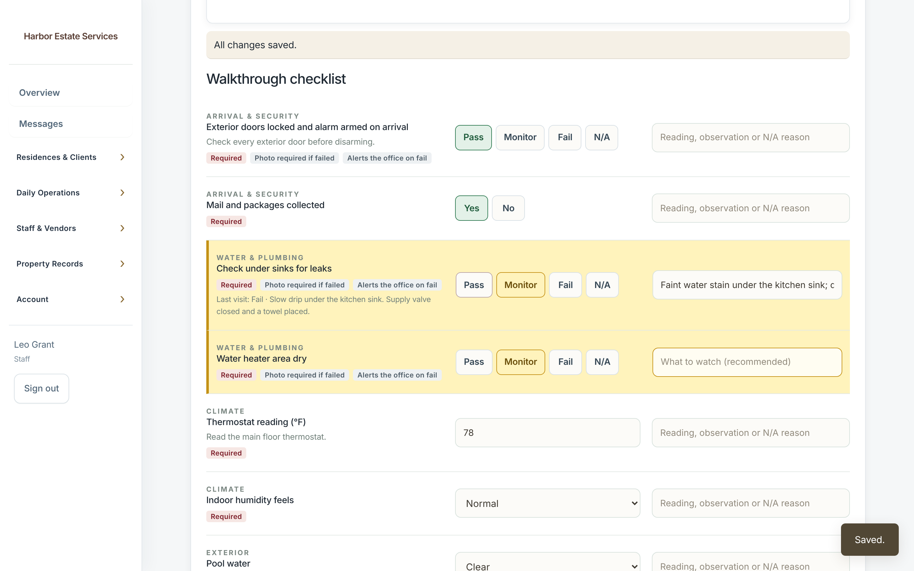
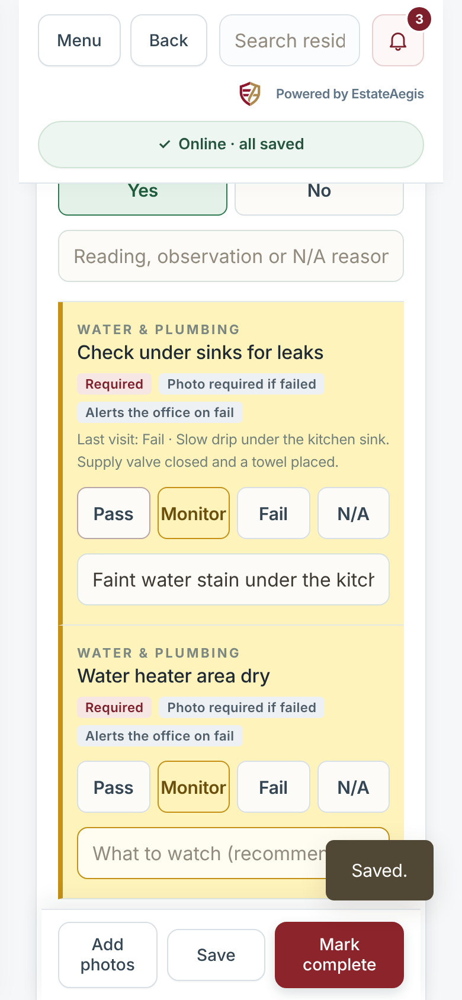
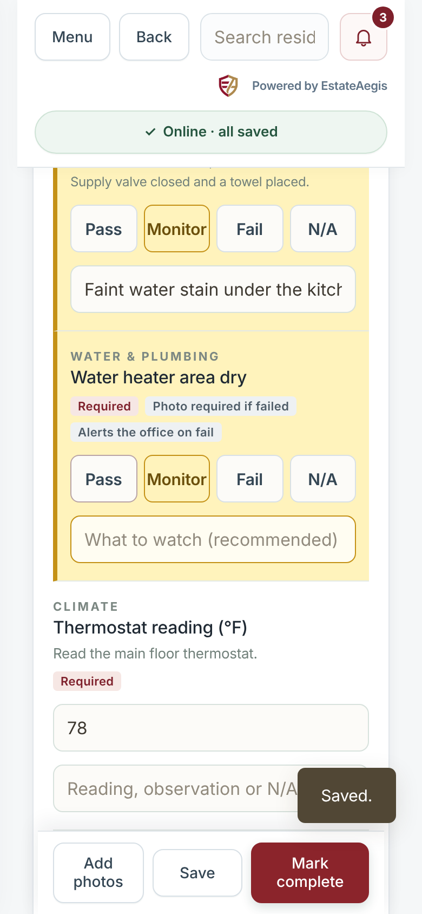
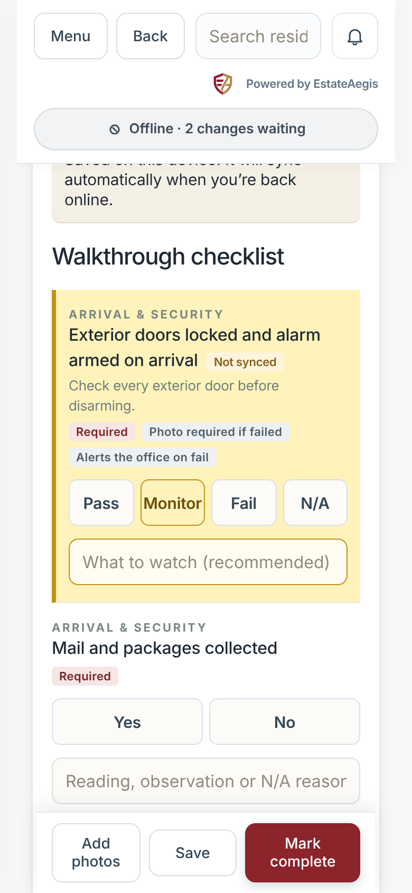
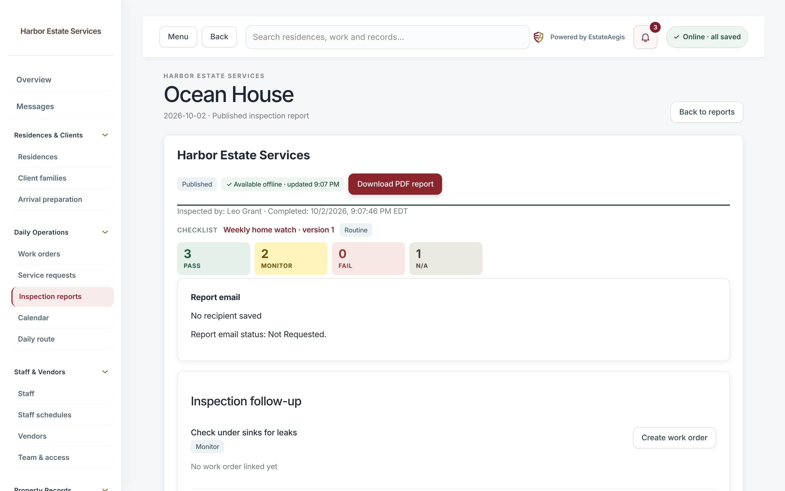
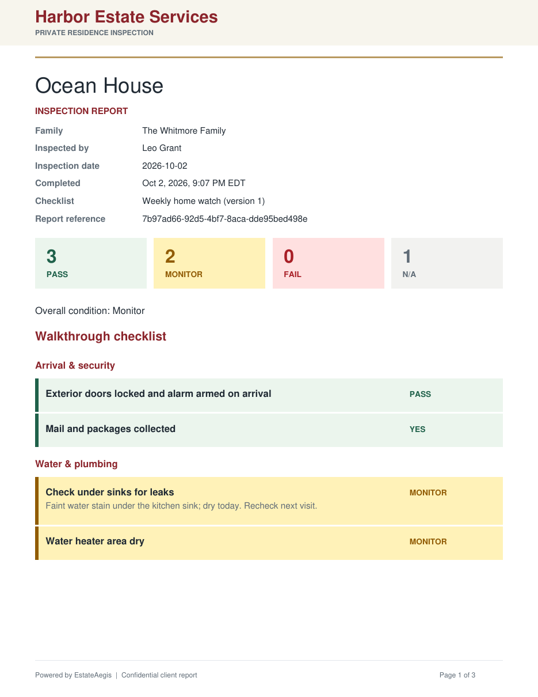
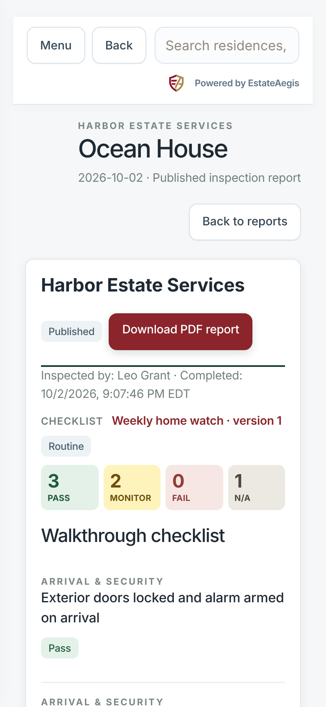
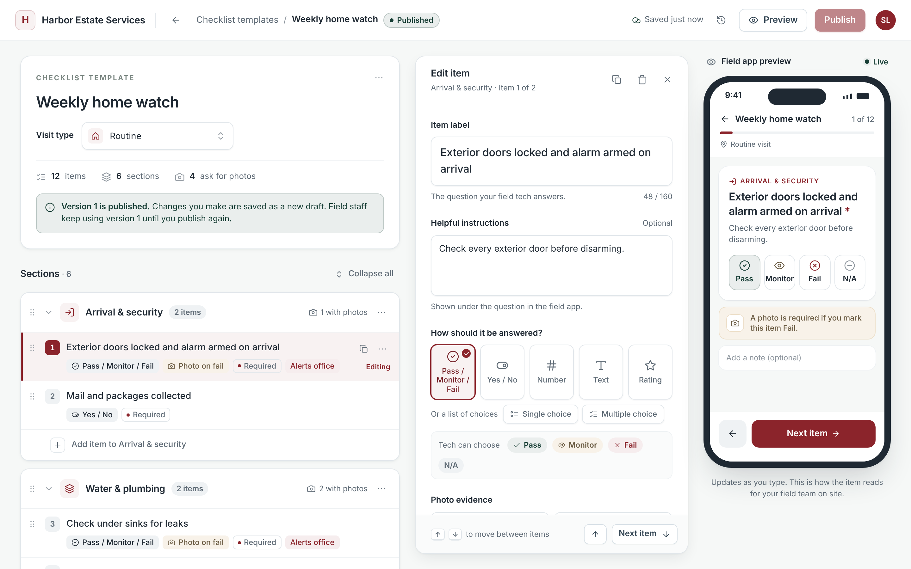

# Monitor answer on template pass/fail items

Pass/fail items in company checklist templates now offer four answers, in this order: **Pass / Monitor / Fail / N/A**. Monitor works the way it does on the built-in checklist: it records something to keep an eye on without treating it as a failure.

## Which items get it

Every item with the existing `pass_fail_na` answer type, everywhere:

- published and draft templates
- every existing template version and visit snapshot
- the starter sets

No new answer type was added, and there is no migration. Monitor is simply a fourth accepted value (`monitor`) for that type. Visits answered before this change keep their `pass` / `fail` / `na` values and render exactly as before, apart from a Monitor total of 0 next to the other totals on template reports.

## Behaviour (matches the built-in checklist's Monitor)

| | Monitor | Fail |
|---|---|---|
| Fail alert ("Alert the office on fail") | never | yes |
| Blocks completion | no | no; a required item only needs an answer |
| Note | not required; the field asks for one | not required |
| "Photo required on fail" | does not apply | needs a photo on the visit |
| Overall condition | "Monitor" when nothing failed | "Action needed" |
| Follow-ups / Action needed | listed in Inspection follow-up, like built-in Monitor | listed, High priority |

**Note prompt:** the built-in checklist never requires a note for Monitor, and neither do templates. When Monitor is chosen, the note field turns amber and asks "What to watch (recommended)" until something is typed. This works online and offline. It never blocks Mark complete.

## Where it shows

- **Field app** (online and offline): a Monitor chip between Pass and Fail. The row turns amber, using the built-in Monitor colours (`#fff3bc` / `#c49116`). On phones the four chips sit on one row.
- **Server validation:** `pass`, `monitor`, `fail` and `na` are accepted for pass/fail items. Anything else, including the built-in `attention`, is rejected with 422.
- **Report and family portal:** submitted and published template visits show **Pass / Monitor / Fail / N/A** totals under the checklist name, and each item shows a "Monitor" badge.
- **PDF:** four total boxes (PASS, MONITOR, FAIL, N/A) and an amber MONITOR pill per item. Built-in reports are unchanged and byte-identical, which the existing sha256 golden test checks.
- **Template editor:** the answer type is called **Pass / Monitor / Fail**. "Tech can choose" lists Pass, Monitor, Fail and N/A, and the phone preview shows all four.

| Desktop | Phone | Note prompt | Offline |
|---|---|---|---|
|  |  |  |  |

| Report | PDF | Portal | Editor |
|---|---|---|---|
|  |  |  |  |

## Compatibility

- An app version from before this change shows three chips. Its saves and offline syncs still validate, because Monitor is only an extra accepted value.
- A visit with a Monitor answer opened on such an app shows no chip selected for that item until the app updates. The service worker cache key changes with the new files, so open apps pick up the update on the next "Reload".
