# Field visits use published checklist templates

Field visits (inspections) are now filled in against the company's **published checklist templates** instead of always using the built-in 28-item checklist.

## Starting a visit: the Checklist picker

**Start inspection** (online) and **Start inspection (offline)** both show, after Residence and Inspection date:

- **Visit type**: Routine, Arrival, Departure, Seasonal, Maintenance, Hurricane prep, Post-storm, Custom.
- **Checklist**: a dropdown listing **every published template** in the company, grouped by visit type (one `<optgroup>` per type). Each option reads `Name · v<version>`, and the newest template in each group is marked `(newest)`. A final **Built-in** group holds "Routine visit · standard built-in checklist".
- **Default:** the newest published template (by `published_at`) for the chosen visit type. If there is none, the built-in checklist. Changing the visit type moves the default. Choosing a checklist from another group switches the visit type to match.
- A note under the picker shows the item count, version, publish date, and "newest of N published … checklists" when there are several.

| Desktop | Options | Phone | Offline |
|---|---|---|---|
| 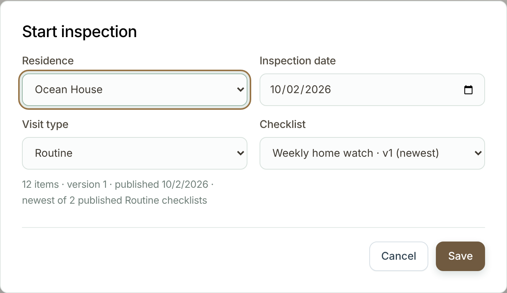 | 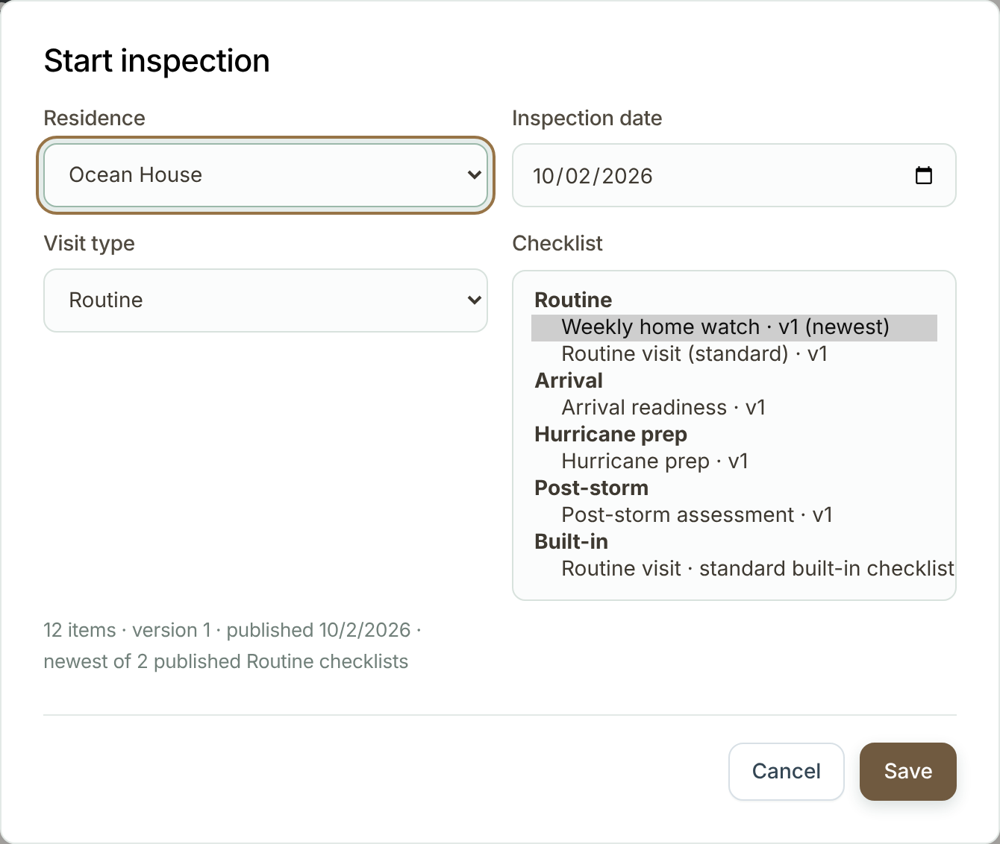 | 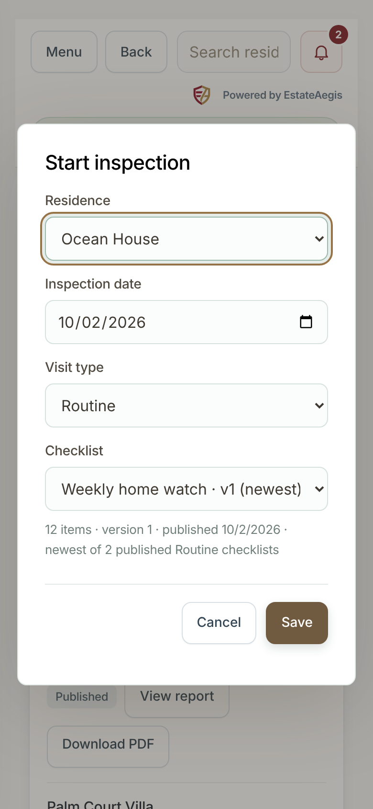 | 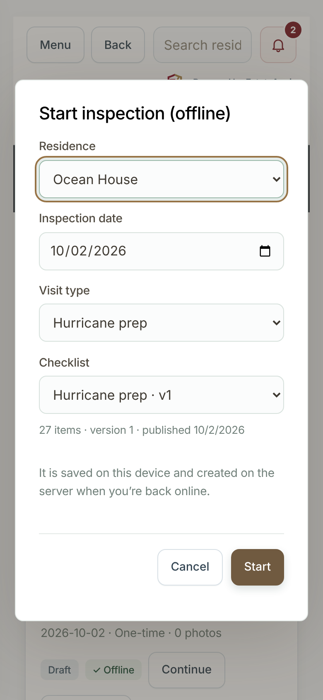 |

API: `POST /api/inspections` accepts the optional `templateId` (a template id, or `"built-in"`), `templateVersionId` and `visitType`. When none is given, it picks the newest published template for the visit type (`routine` by default). Unknown, archived or unpublished templates return 422. Offline starts queued by an older app (they send an `id` but no checklist) get the built-in checklist, exactly as before.

## Scheduling ahead

**Recurring inspection** schedules have a **Checklist** field:

- **Newest published Routine checklist (automatic)**: decided each time a visit is created.
- A specific template: its latest published version at creation time.
- The built-in checklist.

The automation creates the visit with that checklist. If the pinned template has since been archived or unpublished, it falls back to the newest Routine template, then to the built-in checklist. A draft visit's checklist can also be changed with **Change checklist** on the visit until anything has been recorded (`POST /api/inspections/checklist`, 409 after that).

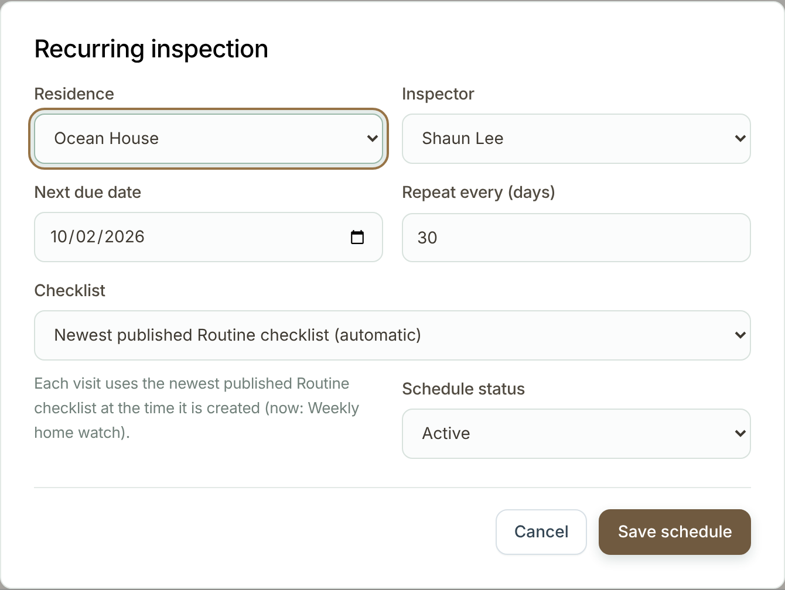

## What is stored

Migration `034_visit_checklist_templates.sql` (additive only):

- `inspections.template_version_id` and `inspections.checklist_snapshot`: the exact published version and a frozen copy of its sections and items. Later edits or new versions never change a started or finished visit.
- `inspections.template_id`, `template_version` and `visit_type` are filled for template visits.
- `inspection_plans.template_id`: `NULL` means automatic, `'built-in'` or a template id.

Built-in visits keep `template_id = NULL` and no snapshot, so they behave and render exactly as before. Existing rows are not migrated.

## Filling in

Each answer is stored in the existing `inspection_answers` table: `item_key` = the template's `stable_key` and `status` = the value.

| Type | Control | Stored as |
|---|---|---|
| Pass / Fail / N/A | chips | `pass`, `fail`, `na` |
| Yes / No | chips | `yes`, `no` |
| Rating | 1–5 chips | `"1"`…`"5"` |
| Number | number input (unit in label) | numeric string |
| Text | textarea | the text |
| Select | dropdown | the option |
| Multi-select | checkboxes | JSON array string |

Unanswered is `unchecked`. Items show **Required**, **Photo required if failed** and **Alerts the office on fail** tags, plus help text. **Room** scope items repeat for each of the residence's rooms (filtered by room type).

The server validates every save against the visit's snapshot: unknown items, wrong value types, and options that aren't in the list are rejected with 422.

**Mark complete** requires every required item. A failed item with "photo required on fail" needs at least one photo on the visit.

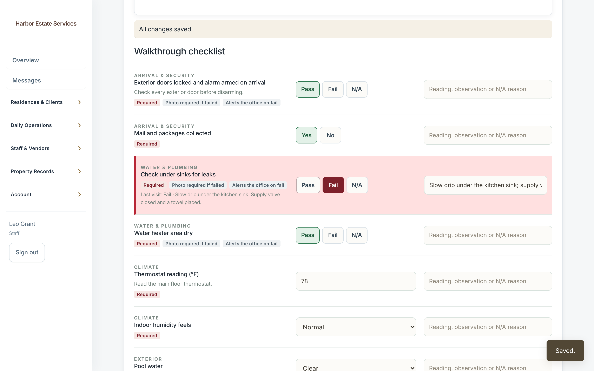

| Phone | Fail | Types | Offline |
|---|---|---|---|
| 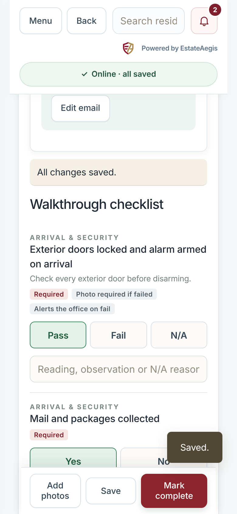 | 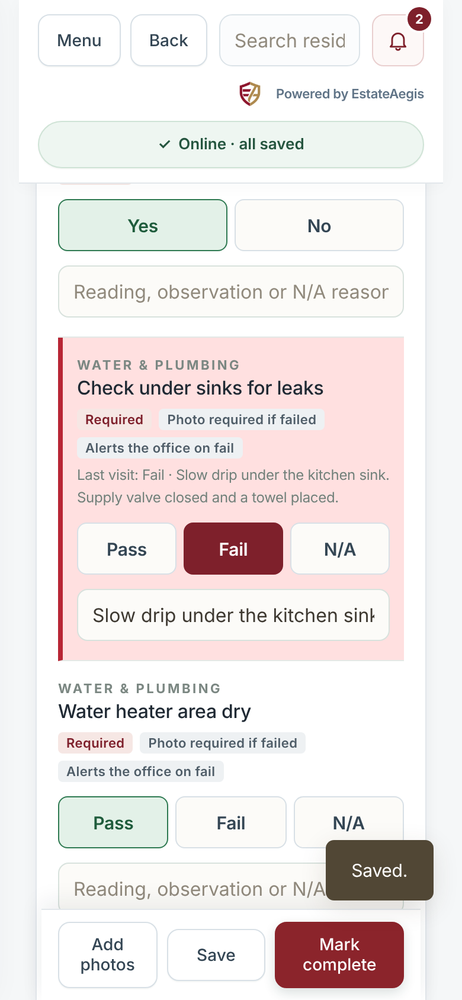 | 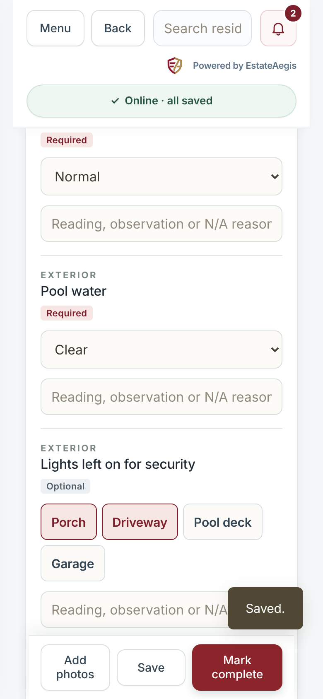 | 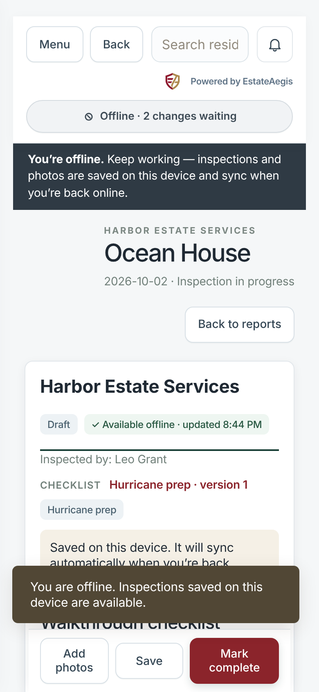 |

## Offline

The offline workspace caches every published checklist with its items. A visit started offline uses the cached version, and the queued start sends `templateVersionId`. The server honours that exact version even if a newer one was published in the meantime, so the answers always match what the inspector saw. Validation, completion rules and tone colours run on the device through the same `public/inspection-checklist.js` module the server uses.

## Reports, PDF and portal

Template visits show a **Checklist** row (`Name (version N)`) and Pass / Fail / N/A summary boxes. Each item gets a pill: PASS, FAIL, N/A, YES, NO, 4/5, the number, the short select option, or RECORDED with an "Answer: …" line. The family portal shows the checklist name and the answers. Built-in visits render exactly as before; the legacy PDF is byte-identical, which a test checks against a sha256 golden.

| Report | PDF | Portal |
|---|---|---|
| 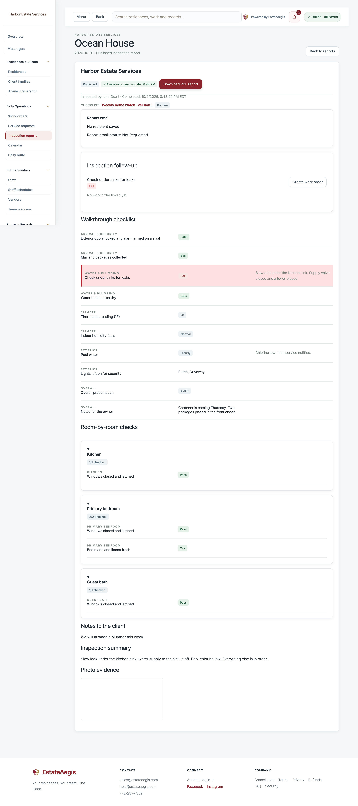 | 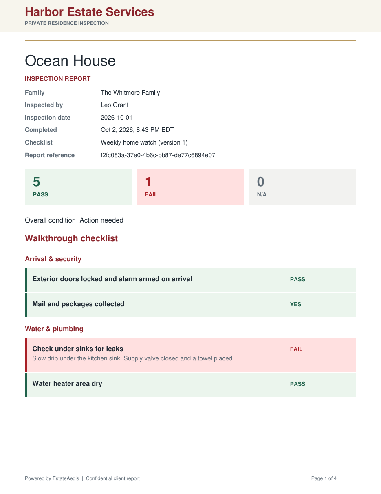 | 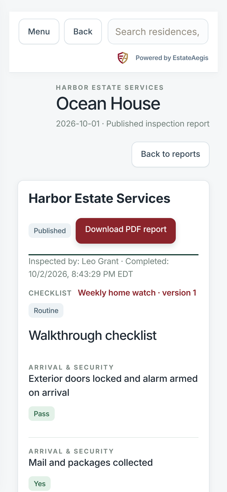 |

## Fail alerts

Linked visits match alert-on-fail items **only by stable key**, in the exact version the visit used. See [checklist-fail-alerts.md](checklist-fail-alerts.md).

## Built-in checklist as a starter

The template editor's **Load starter items** now offers **Routine visit**: the built-in 28 items with the same keys, plus 3 room checks. The previous 5-item set is now called **Routine (short)**. Using the same keys keeps the "Last visit" hints lined up between built-in and template visits.

## Known limitations

- Photos attach to the visit, not to an item, so "photo required on fail" means at least one photo on the visit.
- Templates have no **Monitor** result (pass / fail / N/A only).
- Multi-select answers are stored as a JSON string in `status`.
- Per-residence checklist settings (`property_checklist_settings`) are not applied to template visits.
- Room items expand for the residence's current rooms when the visit is shown, as the legacy room checks do.
