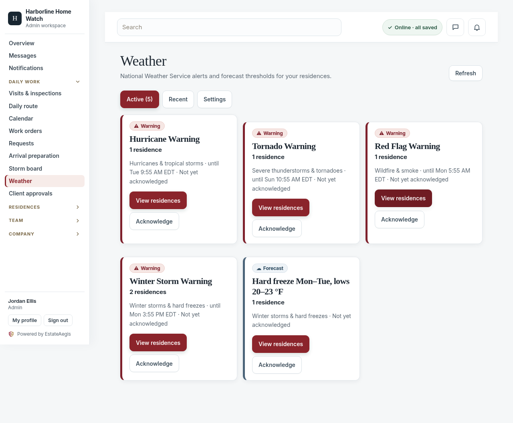
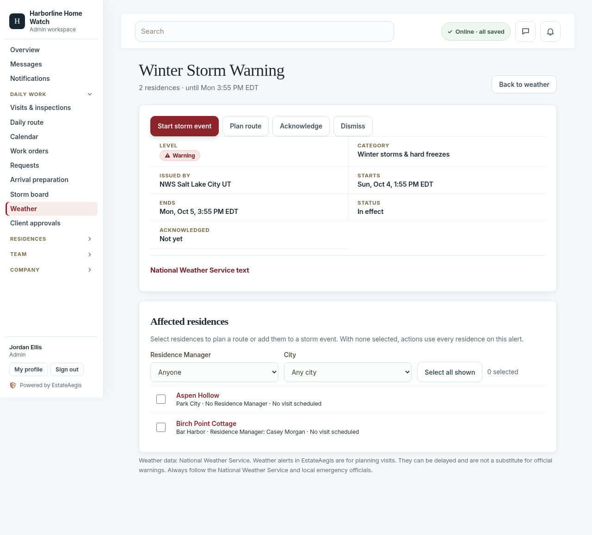
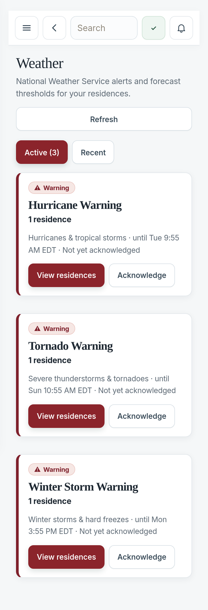
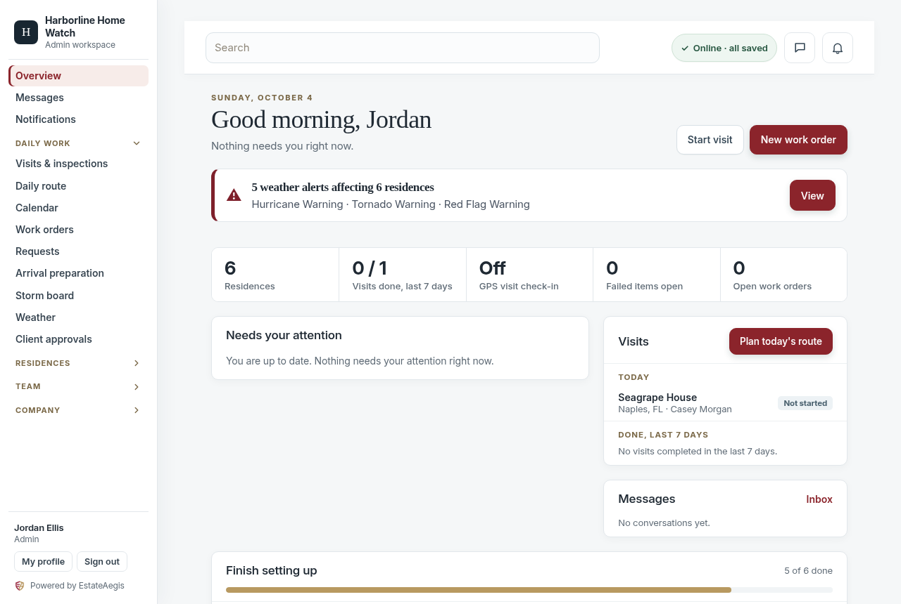
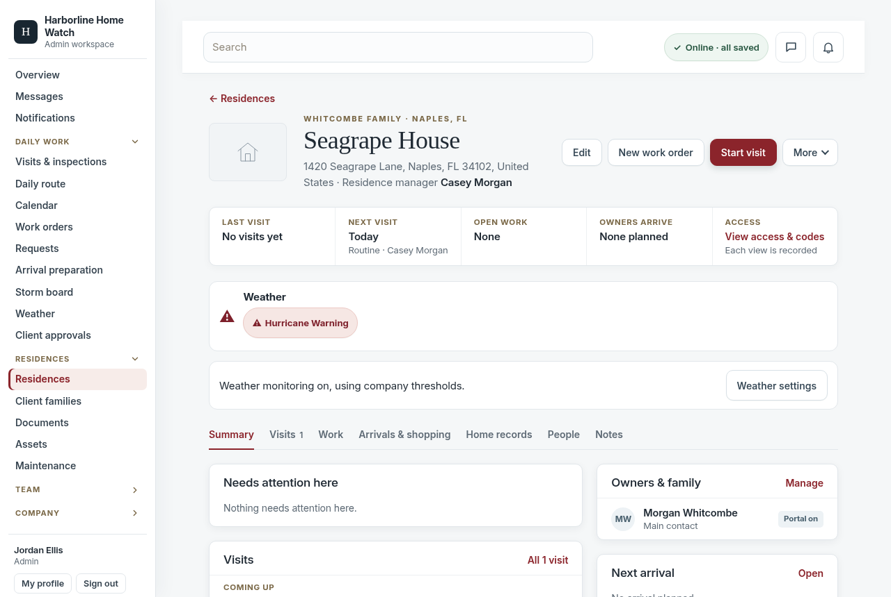
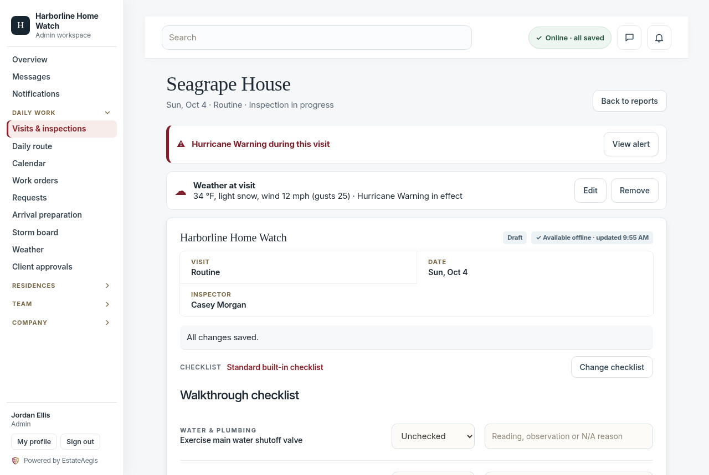
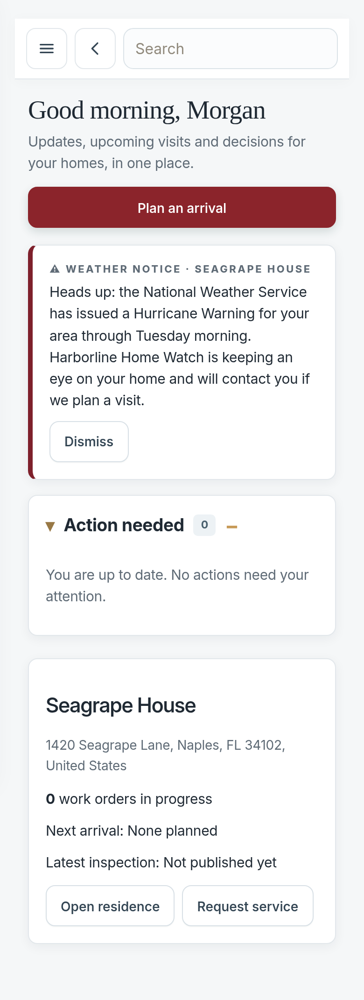
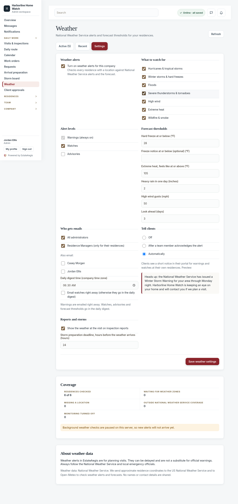

# Severe-weather alerts

EstateAegis watches the weather at every residence. When the **National Weather Service** (NWS) issues a warning, watch or advisory that covers one of your homes, or the forecast shows a **hard freeze, extreme heat, heavy rain or high wind**, your team sees it in the app, the right people get one email, and an admin can turn it into a **storm event** with the affected residences already selected.

It is **off by default**. An admin turns it on in **Weather → Settings** (or **Company settings → Weather alerts**). Until then the Weather menu item is hidden for staff, and nothing is sent to any weather service for that company.

> Weather alerts in EstateAegis are for planning visits. They can be delayed and are not a substitute for official warnings. Always follow the National Weather Service and local emergency officials.

## What your team sees

| Weather page | Alert detail | Phone |
|---|---|---|
|  |  |  |

| Overview banner | Residence | Weather at visit | Client notice (phone) |
|---|---|---|---|
|  |  |  |  |

Settings: 

- **Weather page** (Daily work → Weather): **Active** alerts (most severe first), **Recent** (ended or cancelled in the last 14 days) and, for admins, **Settings**. Each card shows the level (with an icon and the word, never colour alone), the number of residences, when it starts and ends, and whether someone has acknowledged it.
- **Alert detail**: the NWS details (issued by, starts, ends, the full NWS text collapsed), the affected residences with their Residence Manager and next visit, filters by Residence Manager and city, and actions: **Start storm event**, **Add to storm event**, **Plan route**, **Acknowledge** and (admins) **Dismiss** with a reason.
- **Banner** on the Overview: one line per alert ("Hurricane Warning · 12 residences · Tue evening to Thu morning"), collapsed into one line when there are more than two. It disappears once the alert has an open storm event.
- **Residence badges**: residence cards and the residence page show the active alert or forecast ("Hard freeze Tue (low 24 °F)").
- **Route planner**: "Plan route" opens the daily route planner with the affected residences preselected.
- **Weather at visit**: when a visit starts (and again at check-in), the conditions at the residence are saved, for example "34 °F, light snow, wind 12 mph (gusts 25) · Winter Storm Warning in effect". Staff can edit, remove or look it up again while the visit is a draft. When **Show the weather at the visit on inspection reports** is on, the line is frozen into the published report and its PDF (with a small data-source note).

## Who can do what

| | Admin | Staff (employee) | Client | Vendor |
|---|---|---|---|---|
| Turn on, change settings, residence monitoring and thresholds | ✅ | – | – | – |
| See alerts | All residences | Only residences they manage or are assigned to on an open storm | – | – |
| Acknowledge | ✅ | ✅ (their alerts) | – | – |
| Dismiss, start or add to a storm event | ✅ | – | – | – |
| Edit "weather at visit" on a draft | ✅ | ✅ (residences they can work on) | – | – |
| Gentle portal notice | – | – | Their own residences, if the company chooses | – |

Another company's alerts are never visible: every request for them answers "not found".

## Emails

- **Warnings** are emailed right away to admins and to the Residence Manager of each affected residence (each person only sees their own residences). Optional extra team members can be added in settings.
- **Watches, advisories and forecast thresholds** go in one **daily digest** at the company's chosen time (06:30 by default). "Email watches right away" moves watches to immediate emails.
- One email per alert per person: repeats of the same NWS alert, updates and shrinking areas do not email again. A watch upgraded to a warning sends one "Upgraded to …" email. An alert that grows by at least 3 residences (and 25%) sends at most one more email per 6 hours.
- Everyone can choose **All**, **Warnings only** or **None** in **Profile → Weather alert emails**.
- Demo workspaces never send email.

## Client notices

Off by default. In settings choose **After a team member acknowledges the alert** or **Automatically**. Clients then see a short, calm card in their portal for NWS warnings and watches at their own homes only, for example:

> Heads up: the National Weather Service has issued a Hurricane Warning for your area through Wednesday evening. Harborline Home Watch is keeping an eye on your home and will contact you if we plan a visit.

Clients can dismiss it on their device. Forecast thresholds and advisories are never shown to clients.

## Settings

| Setting | Default |
|---|---|
| Categories | All: hurricanes and tropical storms, winter storms and hard freezes, floods, severe thunderstorms and tornadoes, high wind, extreme heat, wildfire and smoke |
| Alert levels | Warnings (always on) and watches; advisories optional |
| Hard freeze at or below | 28 °F (−20 to 40) |
| Freeze notice (optional) | off |
| Extreme heat, feels like at or above | 105 °F (80 to 130) |
| Heavy rain in one day | 2.0 in (0.5 to 10) |
| High wind gusts | 50 mph (20 to 120) |
| Forecast lookahead | 3 days (1 to 7) |
| Daily digest time | 06:30, company time zone |
| Tell clients | Off |
| Weather on inspection reports | Off |
| Storm preparation deadline | 24 hours before the weather arrives |

Each residence can turn monitoring off or override the thresholds (Residence → Weather → Edit, admins), for example a lower hard-freeze temperature for a home with exposed pipes.

**Coverage** in settings shows how many residences are checked, waiting for weather zones, missing a location, outside NWS coverage (outside the US) or turned off. Residences without a location cannot get alerts; set it on the residence page, or use **Look up missing locations** when address lookup is configured.

## How it works

- **Locations**: each residence's latitude and longitude (from GPS visit proof or the address lookup). Once per residence (and again if it moves, or every 30 days) the server asks NWS for its forecast zone, county, fire-weather zone and forecast grid.
- **Alerts** (every 10 minutes): one NWS request per state that has monitored residences, shared by all companies. An alert matches a residence by its polygon when NWS gives one, otherwise by zone. Alerts for the same event (for example the same Winter Storm Warning from two NWS offices) become one company alert. Updates replace what they update, cancellations end the alert, and a warning replaces its watch. If a state's request fails, its alerts stay as they were until the next good check, and nothing is re-sent.
- **Forecasts** (every 3 hours): NWS gridded forecasts by default (one request per forecast grid cell, cached for 3 hours). A residence already under an NWS alert of the same kind is not repeated as a forecast alert. Open-Meteo can be used instead with a paid key.
- **Digest** (checked every 15 minutes, sent once a day per company at its time).
- Jobs run inside the web service once a minute when `WEATHER_JOBS_ENABLED=true`, with a database lease so only one instance runs each job. Every run is recorded in `weather_job_runs`; `GET /api/weather/health` shows the last run of each job to admins, and recent runs, errors and configuration checks to the platform owner. As an alternative, a Render Cron Job can call `POST /api/internal/cron/weather` with header `X-Cron-Secret: <CRON_SECRET>` and body `{"job":"alerts"}` (or `points`, `forecast`, `digest`, `all`).

## Privacy

We send approximate residence coordinates to the US National Weather Service and to Open-Meteo to check weather alerts and forecasts. No names or contact details are shared.

(Coordinates are rounded to 4 decimals for NWS and 2 decimals for Open-Meteo. Open-Meteo is only contacted when it is configured as the forecast provider.)

## Environment variables

| Name | Purpose | Default |
|---|---|---|
| `NWS_USER_AGENT` | Contact string NWS asks every app to send, e.g. `(estateaegis.com, help@estateaegis.com)` | `(estateaegis.com, help@estateaegis.com)` |
| `WEATHER_JOBS_ENABLED` | `true` runs the background jobs in the web service | off |
| `CRON_SECRET` | At least 16 characters; enables `POST /api/internal/cron/weather` | unset (endpoint answers 401) |
| `WEATHER_FORECAST_PROVIDER` | `nws_grid` or `open_meteo` | `nws_grid` |
| `OPEN_METEO_API_KEY` | Open-Meteo customer (commercial) key. Without it Open-Meteo is never used on Render | unset |
| `FEATURE_PILOT_COMPANIES` | Comma list of `platform_owner`, `demo_company` or company ids to turn weather on once (staging pilots). An admin can still turn it off | unset |
| `WEATHER_<JOB>_INTERVAL_MIN` | Override job intervals (`ALERTS` 10, `FORECAST` 180, `POINTS` 60, `DIGEST` 15) | |
| `WEATHER_JOB_BUDGET_MS` | Time budget per job run | 240000 |

Tests point `NWS_BASE_URL` and `OPEN_METEO_BASE_URL` / `OPEN_METEO_CUSTOMER_BASE_URL` at a local stand-in (`tests/weather-mock.mjs`).

## Data sources

Weather data: National Weather Service (public domain). When Open-Meteo is used: Open-Meteo.com (CC BY 4.0), named on screens, emails and reports that use it.
